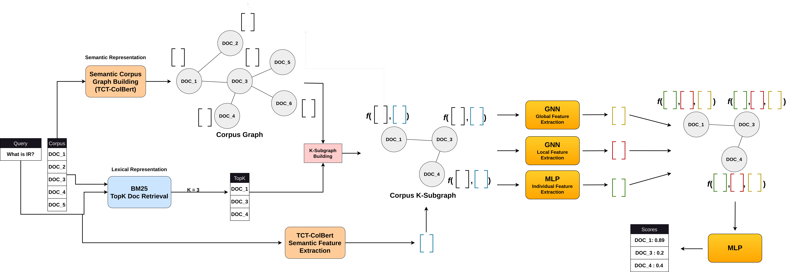

## Graph Neural Re-Ranking via Corpus Graph

### Project Description
This project aims at showing that when we consider cross-document interactions for learning-to-rank, we can improve the ranking performance. Modeling this interaction is done through a Corpus Graph, which is a data structure used to improve the recall of documents. Here we leverage this structure to create connections between different documents that are semantically related.  

### Set-up and installation
```
conda create -n GNRR python=3.8 && conda activate GNRR && conda install pip
```
### Get the required libraries following these bash commands
```
pip install torch==1.12.1+cu113 --extra-index-url https://download.pytorch.org/whl/cu113 && pip install torch_geometric==2.3.1 && pip install torch_scatter torch_sparse torch_cluster torch_spline_conv -f https://data.pyg.org/whl/torch-1.12.1.html

```
```
pip install -r requirements.txt
```

### General Framework
Our framework is presented in figure.

